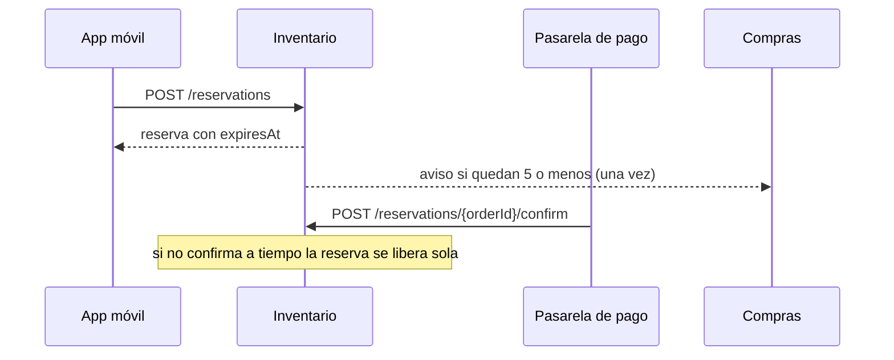

# API de inventario

Para levantarla: `mvn compile exec:java` (puerto 8080). La documentación completa está en Swagger, en `http://localhost:8080/swagger`, y la colección de Postman en `postman/`.

| Método | Ruta | Quién la llama | Qué hace |
| --- | --- | --- | --- |
| POST | `/products` | Backoffice | Registra el sku con su categoría |
| POST | `/products/{sku}/stock` | Compras | Suma unidades y rearma el aviso de stock bajo |
| GET | `/products/{sku}/available` | App móvil | Unidades que todavía se pueden reservar |
| POST | `/reservations` | App móvil al enviar el carrito | Aparta las unidades del pedido hasta que vence el tiempo de pago |
| POST | `/reservations/{orderId}/confirm` | Pasarela de pago cuando aprueba | Deja las unidades como vendidas |

Errores: 400 datos malos, 409 sin stock o sin reserva activa, 422 pasa el límite por pedido.

